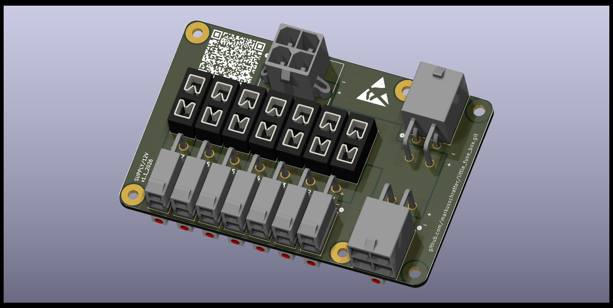
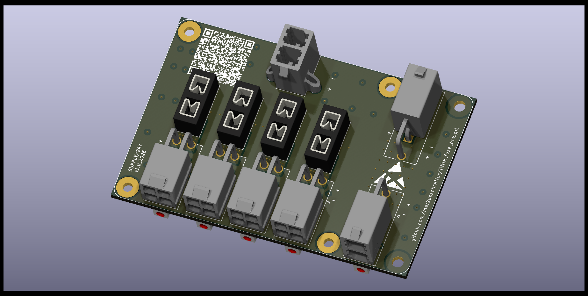

# Power Distribution Boards

This repository contains two power distribution boards: a 12V and a 24V version. Both boards provide multiple protected output channels with automotive fuses and status LEDs.

- Automotive blade fuses (Keystone 3568) for overcurrent protection
- Status LEDs (Kingbright AA4040SURSK) for each output channel
- Molex connectors for reliable power connections
- Multiple input connectors can be mounted for daisy-chaining and connecting with other boards
- Both boards have the same dimensions as Raspberry Pi boards for compatibility with standard mounting solutions

## Specifications

| Board | Input Voltage | Output Channels | Fuse Protection | Max Current/Channel |
|-------|---------------|-----------------|------------------|---------------------|
| 12V | 12V DC | 7 channels | Automotive blade fuse | 5A-30A (fuse dependent) |
| 24V | 24V DC | 4 channels | Automotive blade fuse | 5A-30A (fuse dependent) |

## Overview

### 12V Power Distribution Board
- **7 protected output channels**, each with an automotive blade fuse (Keystone 3568)
- **Input power** via Molex connector
- **Status LEDs** for each output channel



### 24V Power Distribution Board
- **4 protected output channels** with automotive blade fuses
- **Input power** via Molex connectors
- **Status LEDs** for monitoring




## Project Structure

```
little_fuse_box/
├── 12V/                          # 12V power distribution board
│   ├── power_distribution_12V.kicad_sch
│   ├── power_distribution_12V.kicad_pcb
│   ├── power_distribution_12V.kicad_pro
│   └── 3dmodels/                 # 3D models for components
├── 24V/                          # 24V power distribution board
│   ├── power_distribution_24V.kicad_sch
│   ├── power_distribution_24V.kicad_pcb
│   ├── power_distribution_24V.kicad_pro
│   └── 3dmodels/                 # 3D models for components
└── LICENSE
```

## Components

### 12V Board

| Component | Qty | Part Number | Description |
|-----------|-----|-------------|-------------|
| Fuses | 7 | [Keystone 3568](https://www.mouser.at/datasheet/2/215/3568-742601.pdf) | Automotive blade fuse holders |
| LEDs | 8 | [AA4040SURSK](https://www.mouser.com/ProductDetail/Kingbright/AA4040SURSK) | LEDs (Kingbright) |
| Output Connectors | 7 | [39301020](https://www.molex.com/en-us/products/part-detail-pdf/39301020?display=pdf) | Molex Mini-Fit Jr 2-position |
| Power Connector | 1 | [768250004](https://www.molex.com/en-us/products/part-detail-pdf/768250004?display=pdf) | Molex Mega-Fit (J2) |
| Power Connector (DNP) | 1 | [768250004](https://www.molex.com/en-us/products/part-detail-pdf/768250004?display=pdf) | Molex Mega-Fit (J4, optional) |
| Power Connector (DNP) | 1 | [1720650004](https://www.molex.com/en-us/products/part-detail-pdf/1720650004?display=pdf) | Molex (J20, optional) |
| Resistors (5.1kΩ) | 7 | R_0805_2012Metric | (R1-R4, R6-R8) |
| Resistor (500Ω) | 1 | R_0805_2012Metric | (R5) |

**Note**: DNP = Do Not Populate (optional components)

### 24V Board

| Component | Qty | Part Number | Description |
|-----------|-----|-------------|-------------|
| Fuses | 4 | [Keystone 3568](https://www.mouser.at/datasheet/2/215/3568-742601.pdf) | Automotive blade fuse holders |
| LEDs | 6 | [AA4040SURSK](https://www.mouser.com/ProductDetail/Kingbright/AA4040SURSK)| LEDs (Kingbright) |
| Output Connectors | 4 | [39-30-1040](https://www.molex.com/en-us/products/part-detail-pdf/39-30-1040?display=pdf) | Molex Mini-Fit Jr 4-position |
| Power Connectors | 2 | [768250002](https://www.molex.com/en-us/products/part-detail-pdf/768250002?display=pdf) | Molex Mega-Fit 2-position |
| Power Connector | 1 | [172065-0002](https://www.molex.com/en-us/products/part-detail-pdf/172065-0002?display=pdf) | Molex Mega-Fit 2-position |
| Resistors (11kΩ) | 5 | R_0805_2012Metric |  |

**Note**: DNP = Do Not Populate (optional components)


## Design Files

All design files are in KiCad 8.0 format (`.kicad_sch`, `.kicad_pcb`, `.kicad_pro`). 3D STEP and STL models of the boards and components are included in the `3dmodels/` directories.

**3D Board Models:**
- 12V Board: [STEP file](12V/3dmodels/power_distribution_12V.step) | [STL file](12V/3dmodels/power_distribution_12V.stl)
- 24V Board: [STEP file](24V/3dmodels/power_distribution_24V.step) | [STL file](24V/3dmodels/power_distribution_24V.stl)

**Assembly Notes**: Use appropriate automotive blade fuses, verify LED polarity, use proper wire gauge, follow Molex crimping specifications.

## Acknowledgments

Thanks to **Matteo Valentini** for review and modifications.

## License

Licensed under the Apache License, Version 2.0. See [LICENSE](LICENSE) file for details.

## Contributing

Contributions are welcome! Please feel free to submit issues or pull requests.


